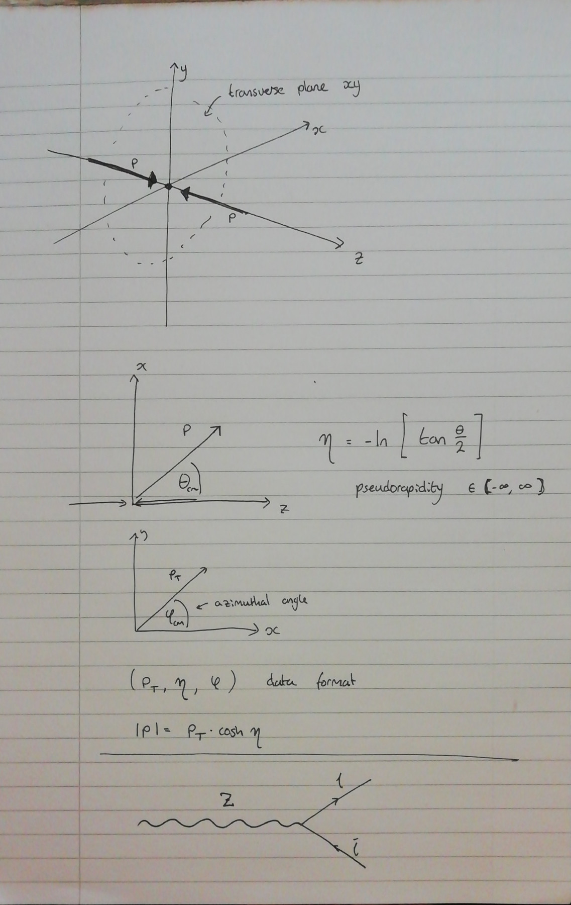
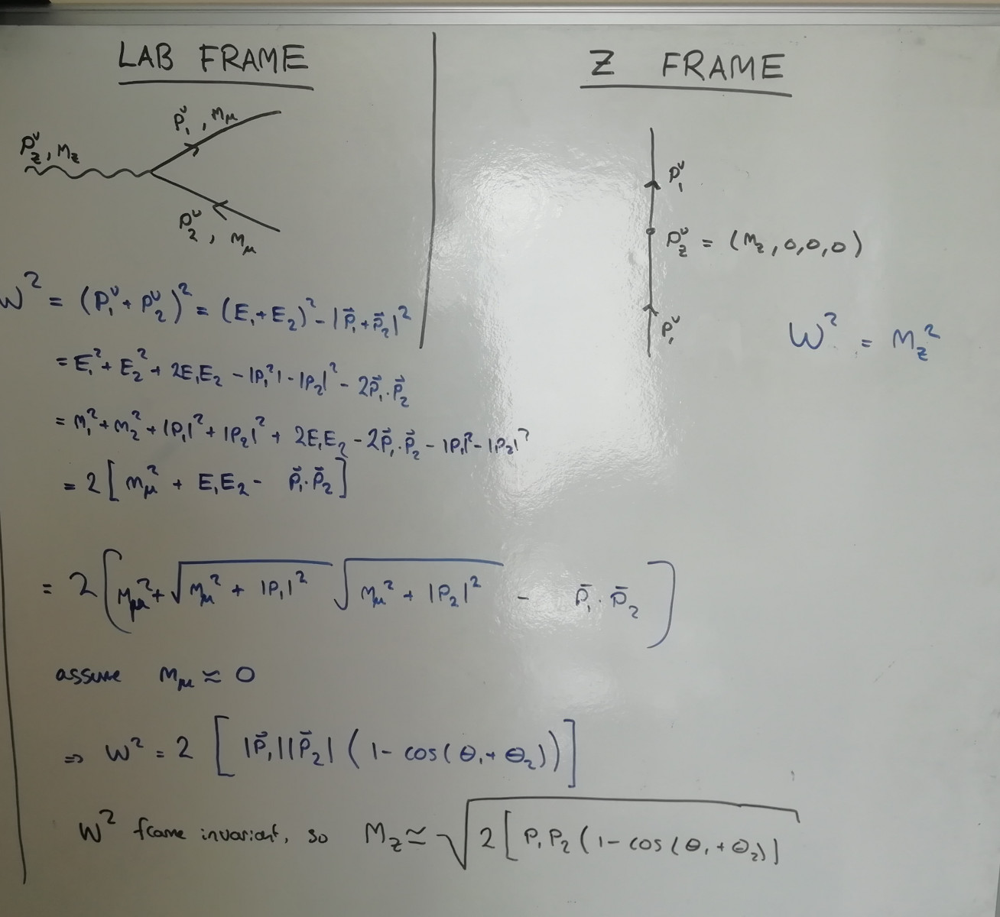
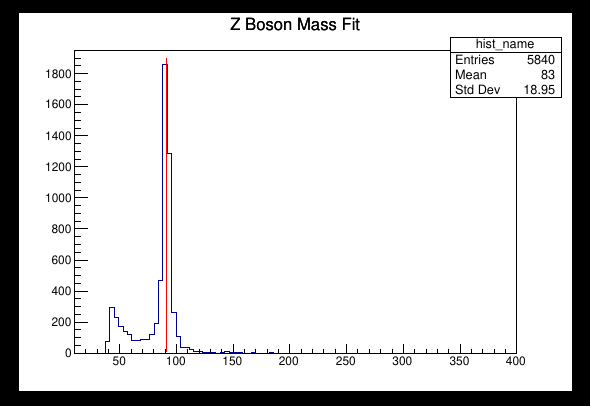
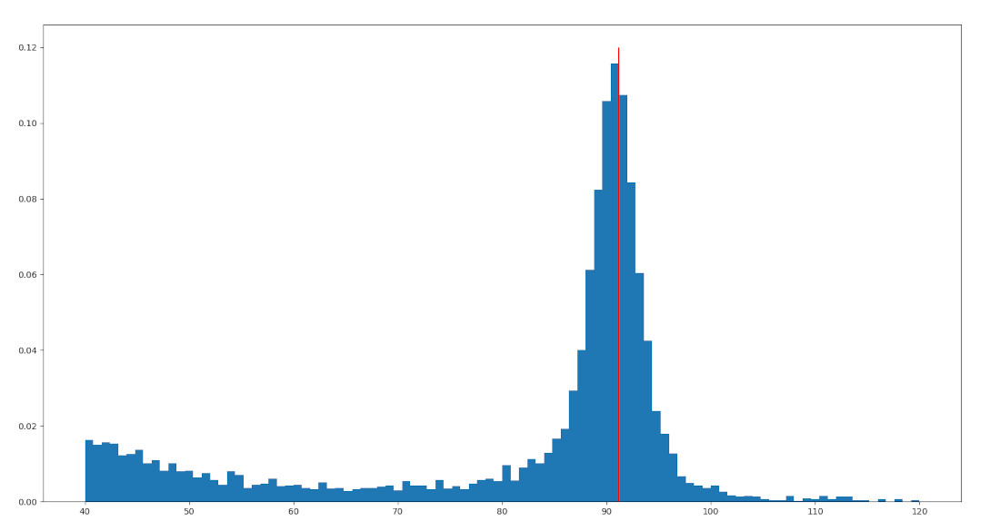

# Rowan Preston weekly progress

## Week 1
 - set up SCRTP account and Github repositories for project
 - Risk assessment

## Week 2
 - Becoming familar with ROOT and the LHCb dataset
 - Worked on using ROOT to find Z boson mass peak as practice for W boson (C++)

    See `examples/findZpeak.cpp`

   

   *Understanding form of the LHCb momenta data*

   

   *Workings for Z boson mass formula*

   

   *Results using derived Z mass formula with LHCb data*

- Found Z mass peak again using Python and TTree/TChain instead

    See `examples/zmass.py`

   

## Week 3
 - Installed Pythia
 - Reading through Pythia and ROOT documentation
 - https://arxiv.org/pdf/0710.3820.pdf intro to pythia8

#### Sources used
 - [W and Z boson](https://indico.cern.ch/event/703646/contributions/2898022/attachments/1600968/2539871/W__Z_bosons.pdf)
 - [TASI Lectures on Collider Physics](https://arxiv.org/pdf/1709.04533.pdf)

